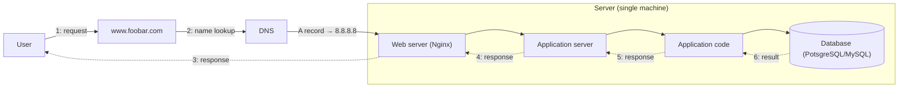
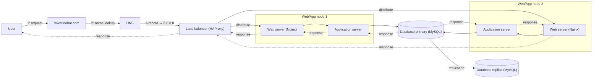

# Web Infrastructure Design

Four progressively more complex designs of the infrastructure behind
`www.foobar.com`, from a single server to a tiered, redundant, monitored
system. Each task has a matching `.mmd` Mermaid file. The diagrams are
reproduced inline below so they render directly on GitHub; the source of
truth is the `.mmd` file.

---

## 0. Model a Single-Server Web Stack

File: [`single_server_stack.mmd`](./single_server_stack.mmd)

### Server: physical or virtual, OS, data center, vs. services

- **Physical or virtual** — A server is a machine, physical (bare metal) or
  virtual (a slice of a physical machine's resources managed by a
  hypervisor). From the outside, both behave the same way: they accept
  requests on a network and answer them.
- **Operating system** — A server always runs an OS (e.g. Linux) that
  manages its hardware or virtual resources, schedules processes, and lets
  other software — like the web server and application server — run on
  top of it.
- **Data center** — A server is commonly hosted in a data center: a
  facility that provides power, cooling, physical security, and network
  connectivity so the machine stays reachable and running.
- **Server vs. services** — The server is the machine; the web server,
  application server, and database are software processes ("services")
  installed and run on that machine. One server can host several services
  at once, which is exactly what happens here.

### DNS and the A record

DNS translates a human-readable domain name into the IP address a client
needs to open a network connection. When the user's browser looks up
`www.foobar.com`, DNS returns the address of the server that hosts the
site. Here that record is an **A record** — the DNS record type that maps
a name directly to an IPv4 address (`8.8.8.8`) — because the `www` host
needs to resolve straight to the server's IP, not to another domain name
(which would instead be a CNAME).

### Roles of the components inside the server

- **Web server (Nginx)** — Accepts incoming HTTP(S) connections, and
  serves static files directly or forwards dynamic requests to the
  application server.
- **Application server** — Executes the application code needed to build
  a dynamic response (business logic), separate from the job of speaking
  HTTP to clients.
- **Application code** — The actual program logic (e.g. a Python/PHP/Node
  codebase) that the application server runs to process a request.
- **Database (PostgreSQL/MySQL)** — Stores and retrieves the persistent
  data the application needs (users, content, etc.), separate from the
  code that uses it.

### Network communication: TCP/IP

The user and the server are two different machines connected by a
network, not by direct memory access. They exchange data using the
TCP/IP protocol suite: IP handles addressing and routing packets between
the two machines, and TCP on top of it guarantees the bytes arrive
in order and without loss, which is what lets HTTP work reliably.

### LAMP, and why this is only LAMP-like

**LAMP** is a classic web-stack acronym for **L**inux (OS) + **A**pache
(web server) + **M**ySQL (database) + **P**HP (application
language/runtime). This design is **LAMP-like**, not a literal LAMP
stack: it keeps the same layering (OS, web server, database, application
code) and can run on Linux with MySQL, but it swaps Apache for **Nginx**
and does not commit to PHP — the application server/code can be written
in any language. "LAMP-like" describes the shape of the stack, not this
exact set of technologies.

### Limitations

- **Single point of failure (SPOF)** — Everything (web server,
  application server, application code, database) runs on one server. If
  that machine, its OS, or any one of those services crashes, the whole
  site goes down.
- **Downtime during maintenance** — Any update, patch, restart, or
  reconfiguration of the server has to happen on the machine that is
  currently serving traffic, so maintenance directly causes downtime.
- **No capacity to scale** — All traffic is handled by one server's
  finite CPU, memory, and network capacity. When traffic grows beyond
  what that single machine can handle, requests slow down or fail, and
  there is no second server to absorb the extra load.

---

## 1. Add Redundancy and Traffic Distribution

File: [`redundant_web_tier.mmd`](./redundant_web_tier.mmd)

### Why the load balancer and the redundant paths were added

The single-server design had one path from the entry point to the
database, so any failure or overload of that one path took the whole
site down. Adding a **load balancer** in front of **two** identical
web/application paths removes that dependency on any single web or
application server: if one path fails, the other can still serve
traffic, and normal traffic can be split across both, increasing total
capacity.

### Active-active vs. active-passive

The two web/application paths here are **active-active**: both
`Web/App node 1` and `Web/App node 2` are up and receiving real traffic
from the load balancer at the same time. This is different from
**active-passive**, where one path handles all traffic and the second
sits idle, only taking over if the first one fails. Active-active uses
both nodes' capacity continuously; active-passive keeps a node in
reserve purely for failover.

### Load-distribution method: round robin

One common method is **round robin**: the load balancer sends each new
request to the next server in the list, cycling back to the first once
it reaches the last (node 1, then node 2, then node 1 again, and so on).
It is simple and spreads requests evenly when the nodes are similarly
sized and requests are roughly uniform in cost.

### Database primary, replica, and replication

**Database primary (MySQL)** is the database instance that the
application servers write to and read from. **Database replica (MySQL)**
is a copy that continuously receives changes from the primary through
**replication** — a one-way flow that keeps the replica's data in sync
with the primary's. Replication here only copies data; it does not by
itself make the replica take over write traffic if the primary goes
down. No automatic failover is implied — that would require a separate
mechanism.

### Remaining single points of failure

- The **load balancer** is now the single entry point for all traffic:
  if it fails, both web/application paths become unreachable.
- The **database primary** is the only node in the diagram that accepts
  writes: if it fails, the application can no longer write data, even
  though the replica still holds a readable copy.

### Remaining limitations

Traffic still travels in the clear (**no HTTPS**), there are **no
firewalls** filtering or restricting access to any component, and there
is **no monitoring** in place to detect failures, saturation, or unusual
traffic before they cause an outage.

### Cost of redundancy

Adding a load balancer and a second web/application path improves
availability (a failure in one path no longer takes the site down) and
capacity (two nodes can serve more traffic than one). That benefit comes
with a real cost: more servers to provision, patch, and pay for, and
more moving parts (load-balancer configuration, replication) to operate
and monitor.

