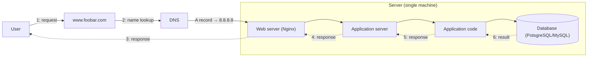

# Web Infrastructure Design

Progressively more complex designs of the infrastructure behind
`www.foobar.com`, from a single server to a tiered, redundant, monitored
system. Each task has a matching `.mmd` Mermaid file. The diagrams are
reproduced inline below so they render directly on GitHub; the source of
truth is the `.mmd` file.

---

## 0. Model a Single-Server Web Stack

File: [`single_server_stack.mmd`](./single_server_stack.mmd)

### Server: physical or virtual, OS, data center, vs. services

- **Physical or virtual** — A server is a machine, physical (bare metal) or
  virtual (a slice of a physical machine's resources managed by a
  hypervisor). From the outside, both behave the same way: they accept
  requests on a network and answer them.
- **Operating system** — A server always runs an OS (e.g. Linux) that
  manages its hardware or virtual resources, schedules processes, and lets
  other software — like the web server and application server — run on
  top of it.
- **Data center** — A server is commonly hosted in a data center: a
  facility that provides power, cooling, physical security, and network
  connectivity so the machine stays reachable and running.
- **Server vs. services** — The server is the machine; the web server,
  application server, and database are software processes ("services")
  installed and run on that machine. One server can host several services
  at once, which is exactly what happens here.

### DNS and the A record

DNS translates a human-readable domain name into the IP address a client
needs to open a network connection. When the user's browser looks up
`www.foobar.com`, DNS returns the address of the server that hosts the
site. Here that record is an **A record** — the DNS record type that maps
a name directly to an IPv4 address (`8.8.8.8`) — because the `www` host
needs to resolve straight to the server's IP, not to another domain name
(which would instead be a CNAME).

### Roles of the components inside the server

- **Web server (Nginx)** — Accepts incoming HTTP(S) connections, and
  serves static files directly or forwards dynamic requests to the
  application server.
- **Application server** — Executes the application code needed to build
  a dynamic response (business logic), separate from the job of speaking
  HTTP to clients.
- **Application code** — The actual program logic (e.g. a Python/PHP/Node
  codebase) that the application server runs to process a request.
- **Database (PostgreSQL/MySQL)** — Stores and retrieves the persistent
  data the application needs (users, content, etc.), separate from the
  code that uses it.

### Network communication: TCP/IP

The user and the server are two different machines connected by a
network, not by direct memory access. They exchange data using the
TCP/IP protocol suite: IP handles addressing and routing packets between
the two machines, and TCP on top of it guarantees the bytes arrive
in order and without loss, which is what lets HTTP work reliably.

### LAMP, and why this is only LAMP-like

**LAMP** is a classic web-stack acronym for **L**inux (OS) + **A**pache
(web server) + **M**ySQL (database) + **P**HP (application
language/runtime). This design is **LAMP-like**, not a literal LAMP
stack: it keeps the same layering (OS, web server, database, application
code) and can run on Linux with MySQL, but it swaps Apache for **Nginx**
and does not commit to PHP — the application server/code can be written
in any language. "LAMP-like" describes the shape of the stack, not this
exact set of technologies.

### Limitations

- **Single point of failure (SPOF)** — Everything (web server,
  application server, application code, database) runs on one server. If
  that machine, its OS, or any one of those services crashes, the whole
  site goes down.
- **Downtime during maintenance** — Any update, patch, restart, or
  reconfiguration of the server has to happen on the machine that is
  currently serving traffic, so maintenance directly causes downtime.
- **No capacity to scale** — All traffic is handled by one server's
  finite CPU, memory, and network capacity. When traffic grows beyond
  what that single machine can handle, requests slow down or fail, and
  there is no second server to absorb the extra load.

